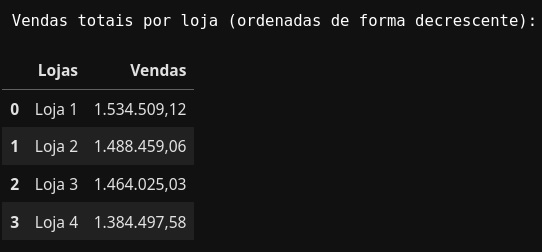
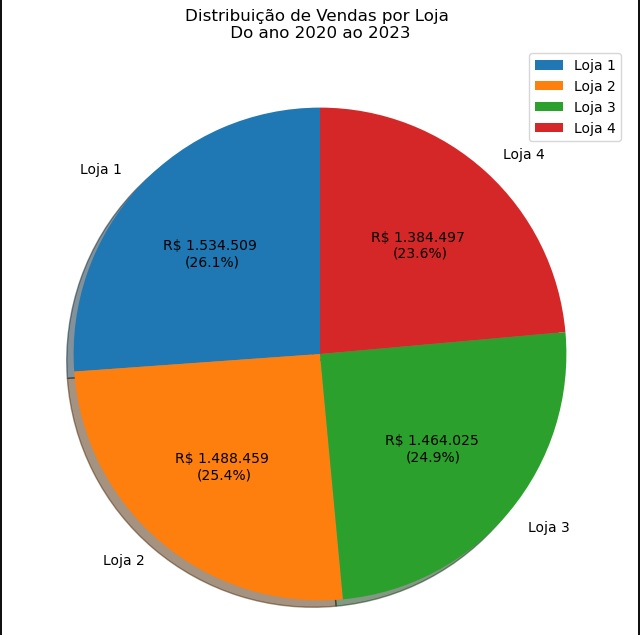
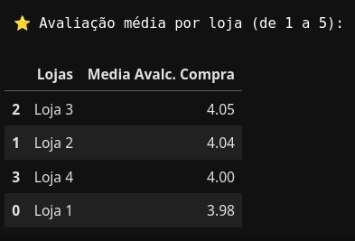
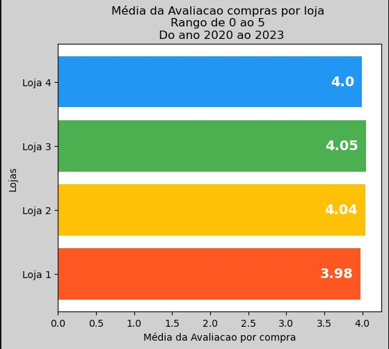
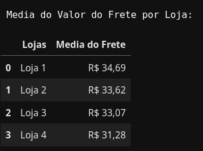
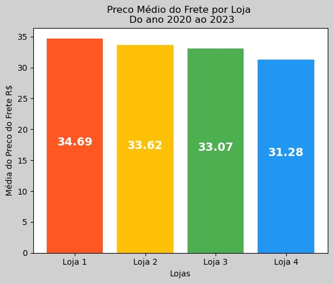
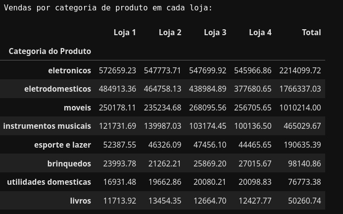
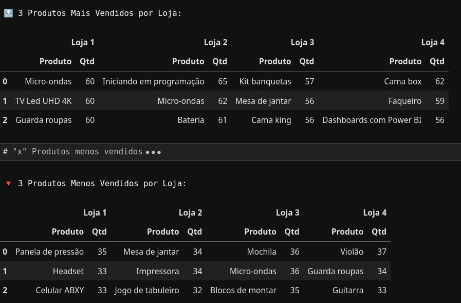

# Relatório de Análise de Desempenho - Alura Store

Este relatório apresenta a análise de dados realizada para a rede de lojas Alura Store, com o objetivo de identificar a loja com menor desempenho para auxiliar o Sr. João em sua decisão de venda e investimento.

## 🛠️ Ferramentas Utilizadas

Para a realização desta análise, foram utilizadas as seguintes ferramentas e bibliotecas:

*   **Linguagem:** Python
    *  Versão do Python: `3.13.2` | packaged by Anaconda, Inc. | (main, Feb  6 2025, 18:56:02) [GCC 11.2.0]
    
*   **Bibliotecas de Análise:**
    *   Pandas: `Versão 2.2.3`
    *   Matplotlib: `Versão 3.10.0`
*   **Ambiente de Desenvolvimento:**
    *   Jupyter Notebook
*   **Versionamento de Código:**
    *   GitHub
*   **Gerenciamento de Projeto:**
    *   Trello

## 🎯 Propósito da Análise

O Sr. João possui uma rede de quatro lojas pertencentes ao e-commerce Alura Store e deseja vender uma delas para obter capital e investir em um novo negócio. O objetivo desta análise é identificar qual das quatro lojas apresenta o menor desempenho comparativamente às outras, fornecendo ao Sr. João uma recomendação fundamentada sobre qual loja vender.

Para tal, foram analisadas as seguintes métricas:
*   Faturamento total por loja
*   Categorias de produtos mais populares por loja
*   Média de avaliação dos clientes por loja
*   Produtos mais e menos vendidos (geral e/ou por loja)
*   Custo médio do frete por loja

Com base nessas métricas, foi possível determinar qual loja apresenta o desempenho relativamente inferior, subsidiando a decisão estratégica do Sr. João.

## 📂 Estrutura do Projeto

O projeto está organizado da seguinte forma:

*   `base-de-dados-challenge-1`: Nesta pasta estão os arquivos CSV com os dados das lojas, mas no notebook utilizaremos os links diretos para o repositório base no GitHub.
*   `README.md`: Este arquivo, contendo o relatório final da análise e as instruções.
*   `AluraStoreBr.ipynb`: Notebook Jupyter contendo todo o processo de análise de dados, desde a importação e limpeza até a geração dos gráficos e cálculos das métricas.
*   `imagens/`: Pasta contendo as capturas de tela dos gráficos gerados no notebook, utilizadas para ilustrar este relatório.
    *   `vendas_totais_pizza.png`
    *   `avaliacoes_medias.png`
    *   `custo_medio_frete.png`
    *   `dataset_avaliacoes_lojas.jpg`
    *   `dataset_media_frete.jpg`
    *   `dataset_productos_mais-menos_vendidos.jpg`
    *   `dataset_ventas_totais_lojas.jpg`
    *   `vendas_categoria.jpg`
    *   `images/AluraStore.gif`

## 📊 Exemplos de Gráficos e Insights Obtidos

A análise visual dos dados permitiu identificar tendências e comparar o desempenho das lojas. Abaixo estão alguns dos principais gráficos e insights:

**1. Distribuição do Faturamento Total por Loja:**
*   O gráfico de pizza ilustra a participação de cada loja no faturamento total acumulado no período analisado (2020-2023).
*   **Insight:** A **Loja 4** apresentou o menor volume total de vendas em comparação com as outras três lojas.

    
    


**2. Avaliação Média das Compras por Loja:**
*   O gráfico de barras horizontais compara a nota média dada pelos clientes às compras realizadas em cada loja.
*   **Insight:** Embora as avaliações sejam relativamente próximas, a **Loja 4** figura na penúltima posição, indicando uma satisfação ligeiramente inferior em comparação com as lojas líderes.

    
    

**3. Custo Médio do Frete por Loja:**
*   O gráfico de barras verticais mostra o valor médio do frete cobrado por cada loja.
*   **Insight:** A **Loja 4** apresenta um dos custos médios de frete mais baixos, o que é um ponto positivo, mas que não se traduziu em maior volume de vendas ou melhor avaliação geral.

    
    

**Observações Adicionais:**
*   Apesar do desempenho geral inferior, a análise por categoria mostrou que a Loja 4 teve um volume relevante em categorias específicas como "Brinquedos" e "Utilidades Domésticas".
*   O desempenho entre as lojas mostrou-se relativamente equilibrado em algumas métricas, mas o faturamento total foi o principal diferenciador negativo para a Loja 4.

    
    

## 🚀 Instruções para Execução do Notebook

Você pode reproduzir a análise e visualizar os gráficos interativamente utilizando seu ambiente local (Jupyter Notebook/Lab) ou diretamente na nuvem através do Google Colab. Siga os passos correspondentes à sua escolha:

### Opção 1: Execução Local (Jupyter Notebook/Lab)

1.  **Pré-requisitos:** Certifique-se de ter o Python e as bibliotecas listadas na seção "Ferramentas Utilizadas" (Pandas, Matplotlib) instaladas em seu ambiente. É necessário também ter o Jupyter Notebook ou JupyterLab. Se necessário, instale as bibliotecas com:
    ```bash
    pip install pandas matplotlib jupyterlab
    ```
2.  **Clone o Repositório:** Clone ou faça o download dos arquivos do projeto a partir do GitHub para o seu computador.
3.  **Navegue até a Pasta:** Abra um terminal ou prompt de comando e navegue até o diretório onde você salvou os arquivos do projeto.
4.  **Inicie o Jupyter:** Execute o comando `jupyter lab` ou `jupyter notebook`.
5.  **Abra o Notebook:** No navegador que será aberto, localize e abra o arquivo `.ipynb` (`AluraStoreBr.ipynb`).
6.  **Execute as Células:** Execute as células do notebook sequencialmente, pressionando `Shift + Enter` em cada uma.
    *   As primeiras células carregam os dados e realizam o tratamento necessário.
    *   As células seguintes executam os cálculos das métricas e geram os dataframes de resultados.
    *   As últimas células são responsáveis pela criação dos gráficos (pizza/barras para vendas, barras horizontais para avaliações, barras verticais para frete, etc.).

   

### Opção 2: Execução no Google Colab

1.  **Acesse o Google Colab:** Vá para [https://colab.research.google.com/](https://colab.research.google.com/).
2.  **Abra o Notebook:** Você tem algumas maneiras de abrir o notebook do projeto:
    *   **Direto do GitHub:** Clique em `Arquivo > Abrir notebook`. Selecione a aba `GitHub`, cole a URL do repositório do projeto na barra de busca (ou a URL direta para o arquivo `.ipynb`) e pressione Enter. Selecione o arquivo `AluraStoreBr.ipynb` na lista.
    *   **Fazer Upload:** Se você baixou o arquivo `.ipynb` para o seu computador (passo 2 da opção local), clique em `Arquivo > Fazer upload de notebook...` e selecione o arquivo `AluraStoreBr.ipynb`.
3.  **Instalar Bibliotecas (se necessário):** O Google Colab geralmente já possui Pandas e Matplotlib pré-instalados. Caso encontre algum erro de importação ou precise de uma versão específica (embora improvável para estas bibliotecas comuns), você pode instalar bibliotecas adicionando uma célula de código no início e executando:
    ```python
    !pip install pandas matplotlib
    ```
4.  **Execute as Células:** Execute as células do notebook sequencialmente, pressionando `Shift + Enter` em cada uma, da mesma forma que faria localmente. O Colab se conectará a um ambiente de execução na nuvem para processar o código.
    *   As células seguirão a mesma lógica: carregar/tratar dados, calcular métricas e gerar gráficos.

Escolha a opção que for mais conveniente para você. Ambas permitirão executar a análise e visualizar os resultados.

## 💡 Análise Preliminar e Conclusão

Com base nos resultados da análise, considerando principalmente o **faturamento total acumulado** entre 2020 e 2023 e as **avaliações médias** dos clientes, a **Loja 4** demonstrou ser a unidade com o desempenho geral mais baixo da rede Alura Store.

Embora a Loja 4 apresente pontos fortes isolados, como um custo de frete competitivo e vendas concentradas em nichos específicos (Brinquedos, Utilidades Domésticas), seu volume total de vendas significativamente inferior às demais e sua posição na penúltima colocação em termos de avaliação média sugerem que esta é a loja com maior potencial para desinvestimento.

Portanto, a recomendação para o Sr. João, com base nos dados analisados, é **considerar a venda da Loja 4**, alinhando-se ao seu objetivo de levantar capital através da alienação da unidade com menor performance global.
